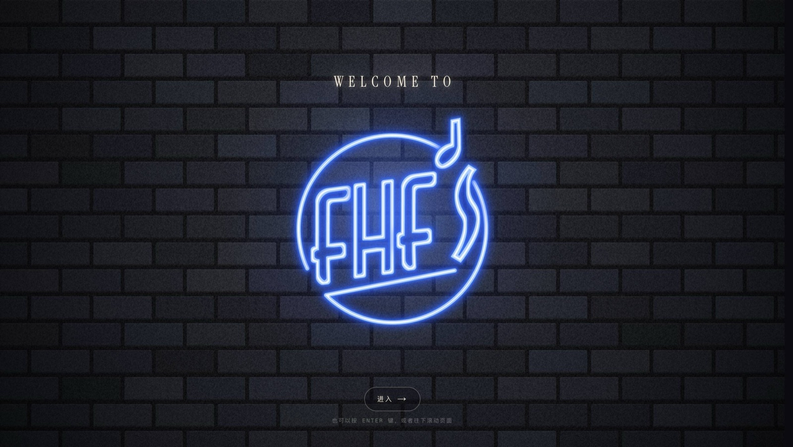
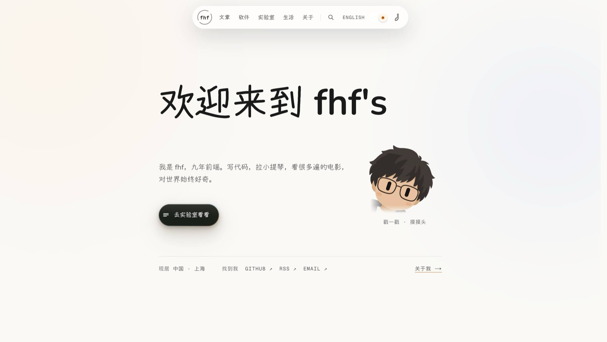
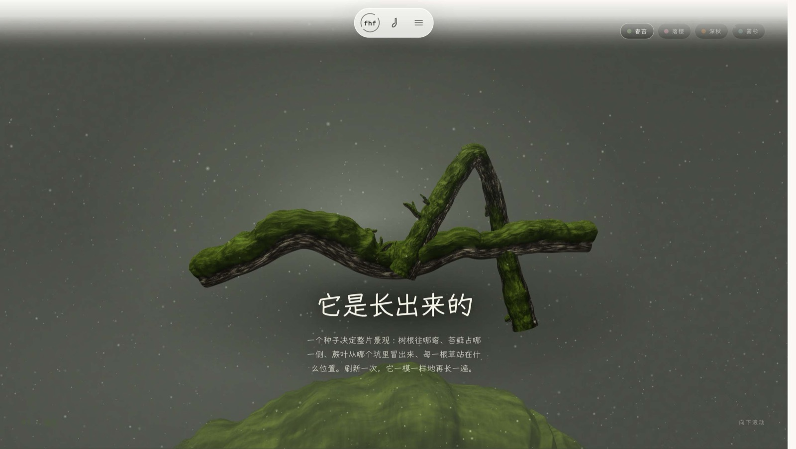
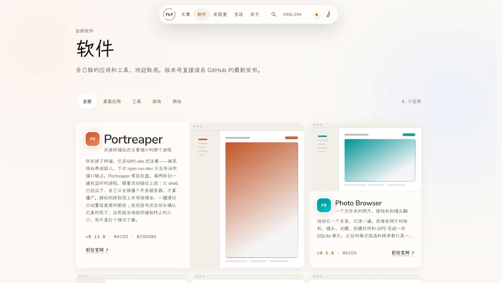

<div align="center">

<a href="https://fhfs-site.vercel.app"></a>

# fhf's

一本个人杂志兼私人画廊：文章、自研软件、33 则动效研究，和几间放唱片的房间。<br>
暖纸色、编辑部式排版、一盏琥珀色的灯；深色主题是「闭馆后」的同一间画廊。

**[fhfs-site.vercel.app](https://fhfs-site.vercel.app)** · [实验室](https://fhfs-site.vercel.app/zh/lab) · [English](https://fhfs-site.vercel.app/en)

[](https://github.com/fanhefeng/fhfs-site/actions/workflows/check.yml)
[](https://github.com/fanhefeng/fhfs-site/actions/workflows/backup.yml)


</div>

| 首页 · 一整屏纸 | 实验室 · 程序生成的苔藓 | 软件 · bento 展柜 |
|:---:|:---:|:---:|
| [](https://fhfs-site.vercel.app/zh) | [](https://fhfs-site.vercel.app/zh/lab/grove) | [](https://fhfs-site.vercel.app/zh/software) |

## 进门之后

- **首页** —— 硬着陆时先是那块霓虹大门（每个会话一次，推门是从圆环里穿过去），然后是一整屏纸：
  宣言、一句自我介绍、会眨眼的小人（戳一戳、摸摸头）、站点唯一的主按钮；往下是正刊三节——
  软件架子、近期文章、此刻（最新一条说说、最新一则实验、最近一次发布）。首页不加载 three.js。
- **/lab** —— 三十三则动效研究，**一则只放一种效果**，分三架：为实验室做的（01–08：滚动帧序列、
  溶解、融化文字、苔藓树根、色散按钮、3D 工作台、镜头畸变、霓虹招牌）、站点在用的（09–26）、
  壳层（27–33：开灯、阅读进度、扇形菜单、推门、换页的雾、灵动岛……）。每则按路由单独拆包，
  页尾逐个链到它由哪些源文件写成。
- **/software** —— keynote 式 bento 展柜，分类筛选用 Flip 重排；版本号读自各仓库的 GitHub 最新
  release；页尾是 Mac / iPhone 设备框，逐个翻看。
- **/blog** —— 目录页式索引，按年分组；文章页单栏 68ch，中文标题逐行揭示、拉丁标题解码进场。
- **/about** —— 点阵名字、横穿屏幕的标语（全站唯一的 pin）、自述，然后是「同一个人，另外两种
  讲法」：**/intro** 一颗由单张照片重建的 3D 头像，滚动带镜头绕头飞行、每张贴纸停一站；
  **/resume** 一页正式简历，「打印 / 存为 PDF」走浏览器打印样式。
- **/life** —— 房间的目录，每间房放自己的唱片：**/moments**「峰言峰语」，五百多条说说，按年排、
  按文集筛，顶上是一面按周排的日历；**/idols** 偶像墙，科比那一页立着一尊用代码搭的 81 分铜像，
  可以拖着转；**/films** 看了很多遍的三部电影，一面剧照墙，点开进原生 `<dialog>` 做的放映厅。
- **⌘K / `/`** —— 全站搜索，面板按需加载，索引是一份静态 JSON。
- **/admin** —— 浏览器里的编辑部：四组十三栏，文章、软件、说说、电影、偶像、简历、全站文案、
  导航都能改，保存即生效；图片、语音、视频从浏览器直传 Vercel Blob，草稿能在自己的页面上预览，
  手机上也能直接发一条说说。

完整的设计语言（材质、动效语法、每页的叙事）在 [`docs/DESIGN.md`](docs/DESIGN.md)；此后每一次改动的
决定、理由和量出来的数字，按日期记在 [`docs/DESIGN-LOG.md`](docs/DESIGN-LOG.md)。

## 工程上的几件事

- **内容在数据库里，页面仍是静态的。** 每个读取函数都是带标签的 `unstable_cache`，后台保存时
  `updateTag`，页面、sitemap、RSS 和 OG 图一起失效——改一个字不用重新部署。
- **不会报错的规矩，写成测试。** [`conventions.test.ts`](src/lib/__tests__/conventions.test.ts)
  读源码而不运行它：每页从 `pageLocale` 开始、库只在 `content.ts` 里读且必须进缓存、每个后台
  action 先验会话后失效缓存、每条缓动都是 `EASE` 表里的名字。违反这些，页面照样能渲染，只是悄悄
  坏掉——所以由测试来报。
- **每一页都有脚本预算。** `pnpm smoke` 用本机 Chrome 走完 sitemap 上的每一页，查 4xx、未捕获
  异常、控制台和 CSP 报错，再把每页的脚本 KB 数和预算表对一遍，超了就红。CI 在只读数据库角色上
  构建后跑它。
- **静态资源按内容寻址。** `asset()` 把文件的 hash 写进地址（`/lab/lens/sea.c694b7cb.jpg`），
  只有带 hash 的地址缓存一年；换文件不用改名。
- **数据有退路。** 每晚导出一次到 `db-snapshots` 分支，有行的表变空就拒绝提交；
  [`docs/RECOVERY.md`](docs/RECOVERY.md) 是从「删错一行」到「Neon 账号没了」的三级操作单，
  演练过，全程 298 秒。
- **CSP 不放行任何跨域。** 字体、解码器、音乐全部自托管；唯一的例外是说说媒体所在的 Blob 存储。
- **模块放在哪，就说明它在哪跑。** `src/lib/server` 与 `src/lib/client` 各自引入 `server-only` /
  `client-only`，放错一边就是构建错误——测试、脚本或 proxy 直接加载的那几个服务端模块除外
  （`server-only` 在它们那里会抛错，清单见 `AGENTS.md`），它们靠所在的文件夹标明。
- **全站只有一个声音。** 一个隐藏的播放器接住页面上每一次 `<audio>` / `<video>` 的播放：别的在响
  它就让路，停了再回来。
- **动效只有一个版本。** `prefers-reduced-motion` 只关掉停不下来的那几处（清单在
  `src/lib/client/gsap.ts`）；SSR 输出完整内容，没有 JS 也能读。

## 技术栈

- Next.js 16（App Router、`proxy.ts`、root params）· React 19 · TypeScript strict
- Tailwind CSS 4 · next-intl（zh / en，`messages/*.json`，库里的 `copy_blocks` 只存改过的行）
- GSAP 3（ScrollTrigger / SplitText / Flip / CustomEase 在 `src/lib/client/gsap.ts` 注册一次）·
  Lenis 惯性滚动，与 GSAP 共用一个时钟
- three.js r185：/intro 与铜像用 @react-three/fiber + drei；苔藓（/lab/grove、/lab/approach）与
  /lab/workstation 是命令式 three。每个场景都在 `next/dynamic` 后面，挂载前先问
  `prefersSaveData()` / `hasWebGL()`
- Neon Postgres（HTTP 驱动）+ Drizzle ORM · jose 签的会话，登录按 IP 限流 · Vercel Blob
- 工具链是 [Vite+](https://viteplus.dev)（`vp`）：Oxlint（带类型感知规则）、Oxfmt、Vitest；
  构建仍是 `next build`

## 本地跑起来

需要 Node 24（`.node-version`）、pnpm 11，和一个 Neon Postgres 库（免费档就够）。

```bash
pnpm install              # 顺带装上 .githooks/ 里的提交钩子
cp .env.example .env.local
pnpm admin:password       # 输入后台密码（直接回车则随机生成），把打印的两行填进 .env.local
pnpm db:migrate           # 建表
pnpm db:import            # 从 backup/ 灌回整站内容——文章、说说、电影、文案都在里面
pnpm dev
```

`.env.local` 里至少要有 `DATABASE_URL`、`AUTH_SECRET`、`ADMIN_PASSWORD_HASH`，缺一个构建就拒绝
开始（规则在 `src/config/env.ts`）；其余几项的用途写在 `.env.example` 里。

```bash
pnpm check           # tsc + lint + 格式 + 测试与覆盖率下限——提交前的那道门
pnpm build           # 生产构建（构建期读库预渲染）
pnpm smoke [url]     # sitemap 上每一页在 Chrome 里走一遍，默认 http://localhost:3000
pnpm assets          # 动了 public/ 之后重算内容 hash
pnpm media:music <源文件> <名字>   # 照其余几首的参数编码一张唱片，并报告首尾静音
pnpm db:generate     # 改了 src/db/schema.ts 之后生成迁移，再 db:migrate
pnpm db:check        # 打印库里每张表的真实内容
pnpm db:export       # 把库写回 backup/
```

改代码之前先读 [`AGENTS.md`](AGENTS.md)：架构、每条规矩为什么存在、哪些测试在守着它们，都写在那里。

## 内容存在哪

内容全部在数据库里，日常编辑走 `/admin`；`src/lib/server/content.ts` 是唯一的读取层。

`backup/` 跟着仓库走，所以内容仍然有 diff、有历史、有一份能离线读的纯文本副本。main 上的
`backup/` 只在开 PR 时才动，而内容是在浏览器里改的——补这个窗口的是每天 03:00 的
`.github/workflows/backup.yml`：跑一次 `db:export`，内容有变就往 `db-snapshots` 分支提交一个
快照；**任何一张有行的表变成空表就拒绝提交并让 job 失败**。这个 workflow 变红要去看。

`messages/*.json` 是**全部** 634 行文案的默认值；库里的 `copy_blocks` 只是叠在上面的覆盖层，而且
只存**改过的那几行**。表空了或者连不上库，站点就照 JSON 显示，不会白屏。`/admin/copy` 照着语言
文件生成，**输入框清空 = 恢复默认**，不是把那处变成空白。

## 两个踩过的坑

改动相关代码前先读：

- **`html` 必须留 `scrollbar-gutter: stable`。** 开场遮罩会锁 `overflow`，那一刻没有滚动条；
  ScrollTrigger 若在此时测量被 pin 的段落，会把 pin-spacer 宽度写死成含滚动条的宽度，遮罩撤走后
  整页就能横向滚动 15px。
- **局部接管滚轮不能只靠 `preventDefault()`。** Lenis 的 wheel 监听挂在 window 上，且**从不检查
  `defaultPrevented`**——3D 工位（当时在 /about，现在是 /lab/workstation）曾经只调
  `preventDefault()`，实测镜头在推拉的同时页面照样滚走（Δ595px）。正确做法是 Lenis 自己的契约
  `data-lenis-prevent-wheel`（它沿 composedPath 读这个属性），并且**只在真正接管的那一刻打开**。

## 出处与许可

代码以 MIT 授权；文字、作者自己的照片与模型、站名与站标保留所有权利；第三方素材（字体、照片、
剧照、音乐、3D 模型）各有各的许可，逐条列在 [`docs/CREDITS.md`](docs/CREDITS.md)。详见
[`LICENSE`](LICENSE)。

部署在 Vercel，push 到 main 即发布。
